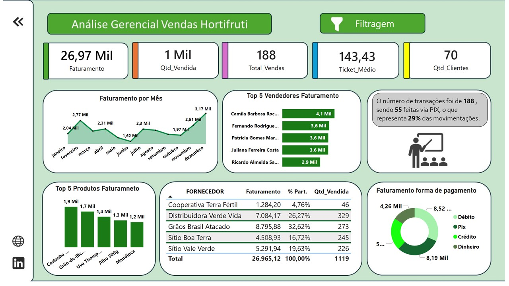

# Banco de Dados e Dashboard — Hortifruti

Projeto de desenvolvimento de um banco de dados relacional para gerenciamento
de informações comerciais de um hortifruti, integrado a um dashboard analítico
para acompanhamento do desempenho das vendas.

O projeto envolve desde a modelagem e estruturação dos dados até a criação de
consultas SQL para análise dos indicadores e desenvolvimento do dashboard no
Power BI.

## Problema de Negócio

Uma empresa do segmento de hortifruti precisava de uma solução para armazenar
e organizar suas informações comerciais em um banco de dados relacional.

A ausência de uma estrutura centralizada dificultava o controle das vendas,
produtos, fornecedores, clientes e formas de pagamento, tornando mais difícil
acompanhar o desempenho do negócio e identificar informações relevantes para a
tomada de decisões.

Diante desse cenário, o projeto buscou desenvolver uma solução composta por:

- Banco de dados relacional para armazenamento e organização das informações;
- Estruturação e relacionamento das tabelas;
- Consultas SQL para extração e análise dos dados;
- Procedures para automatizar operações no banco;
- Dashboard analítico para visualização dos principais indicadores;
- Análises capazes de apoiar decisões relacionadas a vendas, produtos,
  fornecedores e formas de pagamento.

O objetivo foi transformar os dados operacionais do hortifruti em informações
que permitissem compreender o desempenho comercial e identificar oportunidades
de melhoria.

# Objetivo do Projeto

Desenvolver uma solução de dados capaz de centralizar as informações comerciais
do hortifruti e transformá-las em indicadores que auxiliem no acompanhamento
do negócio.

O projeto teve como principais objetivos:

- estruturar um banco de dados relacional;
- organizar informações de vendas, produtos, fornecedores e clientes;
- estabelecer relacionamentos entre as entidades;
- desenvolver consultas SQL para análise dos dados;
- utilizar procedures para operações no banco;
- identificar indicadores relevantes para o negócio;
- construir um dashboard analítico no Power BI;
- transformar os resultados das consultas em visualizações de fácil
  interpretação;
- apoiar a tomada de decisões através da análise dos indicadores.

# Estratégia de Análise

A análise foi desenvolvida em diferentes etapas, partindo dos dados
armazenados no banco até a construção dos indicadores apresentados no
dashboard.

### 1. Estruturação do Banco de Dados

Inicialmente, foi desenvolvido o modelo do banco de dados para organizar as
principais informações do negócio.

Foram estruturadas entidades relacionadas a:

- fornecedores;
- produtos;
- vendas;
- clientes;
- formas de pagamento;
- vendedores.

O relacionamento entre essas entidades permitiu centralizar as informações e
facilitar a realização das análises.

### 2. Consultas SQL

Após a estruturação do banco, foram desenvolvidas consultas SQL para extrair
informações relevantes para o negócio.

Entre as análises realizadas estão:

- faturamento total;
- quantidade de produtos vendidos;
- quantidade de vendas;
- ticket médio;
- faturamento por mês;
- faturamento por fornecedor;
- produtos com maior faturamento;
- desempenho dos vendedores;
- faturamento por forma de pagamento;
- participação das formas de pagamento;
- quantidade de transações;
- participação das vendas realizadas via PIX.

Essas consultas foram utilizadas como base para identificar os valores e
indicadores mais relevantes que posteriormente foram apresentados no dashboard.

### 3. Identificação dos Indicadores

A partir das consultas SQL, foram selecionados os indicadores considerados mais
relevantes para acompanhar o desempenho comercial.

Entre eles:

- Faturamento;
- Quantidade vendida;
- Total de vendas;
- Ticket médio;
- Quantidade de clientes;
- Faturamento por período;
- Faturamento por fornecedor;
- Faturamento por produto;
- Faturamento por forma de pagamento.

### 4. Construção do Dashboard

Com os dados estruturados e os principais indicadores definidos, foi criado
um dashboard analítico no Power BI.

O objetivo foi transformar os resultados obtidos através do banco e das
consultas SQL em visualizações que permitissem identificar rapidamente
tendências, concentrações e pontos de atenção no desempenho comercial.

### Modelagem de Dados — Star Schema

Para a construção do dashboard, foi utilizado o modelo de dados Star Schema (Esquema Estrela), separando as informações em uma tabela fato e diferentes tabelas dimensão.

A tabela fato fVW_FATURAMENTO_ITEM concentra os principais registros das vendas, como valores, itens e datas. Ao seu redor estão as tabelas dimensão, responsáveis por armazenar informações descritivas relacionadas a produtos, categorias, clientes, fornecedores, vendedores e formas de pagamento.

Essa estrutura foi adotada para:

Organizar melhor os dados, separando fatos de informações descritivas;
Evitar redundância, reduzindo a repetição de informações nas vendas;
Facilitar a criação de consultas SQL e análises por diferentes perspectivas;
Melhorar a interpretação dos indicadores no Power BI;
Permitir análises como faturamento por produto, categoria, fornecedor, vendedor e período;
Facilitar a manutenção e expansão do banco de dados.

[Imagem do Projeto2](./Imagens/starschema.JPG)

# Principais Insights

A análise do dashboard permite identificar alguns pontos relevantes sobre o
desempenho do hortifruti.

### 1. Faturamento de aproximadamente R$ 26,97 mil

O negócio apresentou um faturamento total de aproximadamente **R$ 26,97 mil**
no período analisado.

Esse indicador funciona como uma das principais referências para avaliar o
desempenho comercial.

### 2. 1.119 itens vendidos

Foram registradas aproximadamente **1.119 unidades vendidas**, permitindo
analisar o volume comercializado e relacioná-lo ao faturamento obtido.

### 3. 188 transações realizadas

O dashboard apresenta um total de **188 transações**, permitindo acompanhar
não apenas o faturamento, mas também a quantidade de operações realizadas.

### 7. PIX representa uma parcela relevante das transações

Das **188 transações**, **55 foram realizadas via PIX**, representando
aproximadamente **29% das movimentações**.

Esse resultado permite identificar o PIX como uma forma de pagamento relevante
para o negócio.

### 8. Faturamento concentrado nos principais produtos

A análise dos produtos permite identificar quais itens apresentam maior
participação no faturamento, possibilitando direcionar estratégias relacionadas
a estoque, vendas e negociação com fornecedores.

# Como o Projeto Apoia a Tomada de Decisão

A solução desenvolvida permite que a empresa utilize os dados para:

- acompanhar o faturamento;
- identificar os produtos de maior impacto financeiro;
- avaliar o desempenho dos fornecedores;
- acompanhar o desempenho dos vendedores;
- analisar o ticket médio;
- entender o comportamento das formas de pagamento;
- identificar a participação do PIX nas transações;
- acompanhar a quantidade de vendas e produtos comercializados;

## Acesso ao Projeto

O dashboard está disponível para visualização através do link abaixo:

🔗 **[Acessar Dashboard de Analise Comercial](https://app.powerbi.com/view?r=eyJrIjoiZjI2MGJjMTgtYWZmNi00NGM0LWI0ZjMtNDQ4Y2UyOTk0Y2JjIiwidCI6IjFkYjg3Njk3LWJhNWUtNDcyMC1iNmQ1LTIxNzA3Y2Q5YTRjNyJ9&pageName=6ffa5ca964bb0a83d770)

