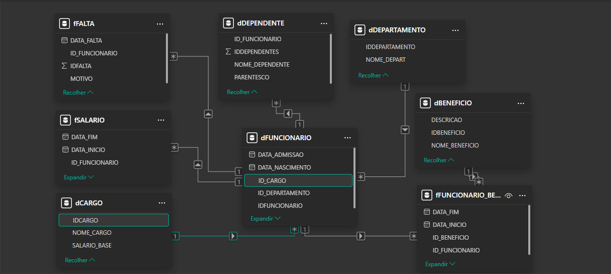
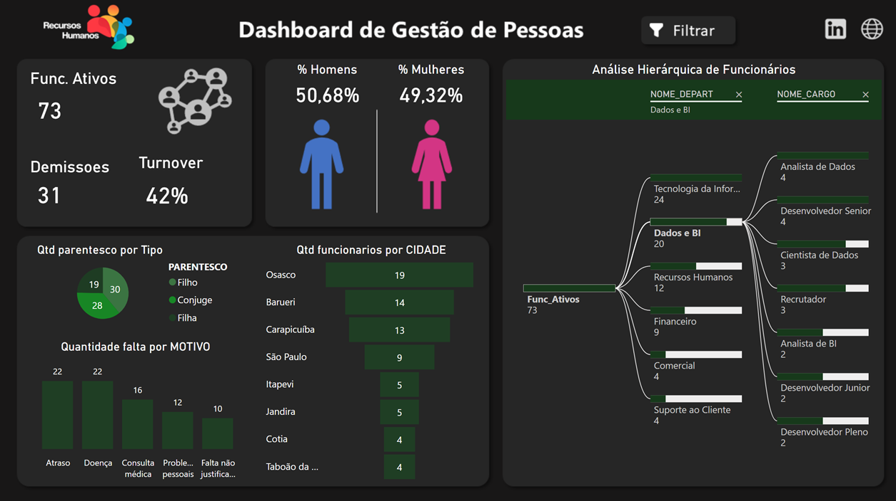

# Banco de Dados e Dashboard — Gestão de Recursos Humanos

Projeto de desenvolvimento de um banco de dados relacional integrado a um dashboard analítico no Power BI, com foco no acompanhamento e análise de informações relacionadas à gestão de funcionários.

A solução foi desenvolvida para centralizar informações de funcionários, departamentos, cargos, salários, benefícios, dependentes e faltas, permitindo transformar dados operacionais em indicadores para apoiar a gestão de Recursos Humanos.

## Problema de Negócio

Um setor de Recursos Humanos precisava de uma solução para organizar e acompanhar de forma mais eficiente as informações relacionadas aos seus funcionários.

A ausência de uma visão centralizada dificultava a análise de indicadores importantes para a gestão, como:

- quantidade de funcionários ativos;
- distribuição de funcionários por departamento;
- distribuição por cargo;
- quantidade de demissões;
- índice de turnover;
- quantidade de faltas;
- principais motivos de ausência;
- distribuição dos funcionários por cidade;
- quantidade de dependentes;
- distribuição por gênero;
- benefícios associados aos funcionários.

Diante desse cenário, o projeto buscou desenvolver uma solução composta por um banco de dados relacional e um dashboard analítico, permitindo que o RH tivesse uma visão mais clara da estrutura e do comportamento de seu quadro de funcionários.

## Objetivo do Projeto

Desenvolver uma solução de dados capaz de centralizar informações de Recursos Humanos e transformá-las em indicadores que auxiliem no acompanhamento dos funcionários e na tomada de decisões.

O projeto teve como principais objetivos:

- estruturar um banco de dados relacional;
- organizar informações relacionadas aos funcionários;
- estabelecer relacionamentos entre as entidades;
- armazenar informações de cargos e departamentos;
- controlar informações salariais;
- registrar faltas e seus respectivos motivos;
- relacionar funcionários aos seus benefícios;
- armazenar informações sobre dependentes;
- desenvolver consultas para análise dos dados;
- criar indicadores relevantes para a área de RH;
- construir um dashboard analítico no Power BI;
- facilitar a identificação de pontos de atenção relacionados à gestão de pessoas.

## Solução Desenvolvida

A solução foi dividida em duas principais etapas:

**Banco de Dados**

Foi desenvolvido um banco de dados relacional para organizar as informações do setor de Recursos Humanos, utilizando entidades relacionadas a funcionários, departamentos, cargos, salários, benefícios, dependentes e faltas.

Essa estrutura permite manter os dados organizados e relacionados, possibilitando consultas e análises sob diferentes perspectivas.

O modelo contempla tabelas para:

- Funcionários;
- Cargos;
- Departamentos;
- Salários;
- Benefícios;
- Funcionários e benefícios;
- Faltas;
- Dependentes;
- Telefones.

O banco utiliza **chaves primárias, chaves estrangeiras e constraints** para estabelecer os relacionamentos e aplicar regras de integridade aos dados.

### 2. Dashboard

Os dados do banco foram utilizados na construção de um dashboard de Gestão de Pessoas, permitindo transformar os registros operacionais em indicadores e análises visuais para o setor de RH.

---

## Modelagem do Banco

O banco foi estruturado seguindo uma abordagem relacional, conectando informações de funcionários às suas respectivas áreas, cargos, salários, benefícios, faltas e dependentes.

### Principais relacionamentos

- Funcionário → Cargo
- Funcionário → Departamento
- Funcionário → Dependentes
- Funcionário → Faltas
- Funcionário → Histórico Salarial
- Funcionário → Benefícios
- Benefício → Funcionários

### Modelo de dados

---

## Estratégias de Análise

Para transformar os dados do banco em informações úteis para o RH, foram utilizadas diferentes abordagens de análise.

### Análise de quadro de funcionários

Avaliação da quantidade de funcionários ativos e sua distribuição entre os departamentos e cargos.

### Análise de absenteísmo

Identificação da quantidade de faltas e dos principais motivos registrados, permitindo observar possíveis pontos de atenção relacionados à frequência dos colaboradores.

### Análise de turnover

Acompanhamento dos desligamentos em relação ao quadro de funcionários, permitindo ao RH observar o nível de rotatividade da empresa.

### Análise salarial

Comparação dos salários atuais dos funcionários, incluindo classificações salariais e identificação de colaboradores acima da média salarial.

### Análise de benefícios

Avaliação dos benefícios associados aos funcionários e dos respectivos valores.

### Análise demográfica

Distribuição dos funcionários por gênero e localização, permitindo uma visão geral do perfil do quadro de colaboradores.

### Análise hierárquica

Exploração da estrutura organizacional através da relação entre departamentos, cargos e quantidade de funcionários.

---

## Consultas SQL

Durante o desenvolvimento foram utilizadas diferentes técnicas de SQL para exploração e análise dos dados.

Entre elas:

- `INNER JOIN`;
- `LEFT JOIN`;
- `GROUP BY`;
- `HAVING`;
- `ORDER BY`;
- Funções de agregação;
- `CASE WHEN`;
- `CTE (Common Table Expressions)`;
- Subqueries;
- Tabelas temporárias;
- `ISNULL`;
- Consultas envolvendo múltiplas tabelas.

As consultas foram utilizadas para responder perguntas como:

- Quais são os funcionários e seus respectivos cargos?
- Quantos dependentes cada funcionário possui?
- Quantas faltas cada funcionário possui?
- Quais funcionários possuem salário acima da média?
- Qual funcionário possui o maior salário?
- Quais funcionários possuem mais faltas que a média da empresa?
- Qual é o maior salário de cada departamento?
- Quais funcionários possuem salário acima de determinado valor?

---

## Procedures

Também foram desenvolvidas **Stored Procedures** para automatizar algumas operações do banco.

### `ADMITIR_FUNC`

Responsável por realizar o cadastro de um novo funcionário e registrar seu salário inicial.

### `ATUALIZAR_SALARIO`

Responsável por atualizar o salário de um funcionário mantendo o histórico salarial.

A procedure encerra o registro salarial atual e cria um novo registro com o novo valor.

### `REGISTRAR_FALTA`

Responsável por registrar uma nova falta vinculada a um funcionário.

---

## Dashboard — Gestão de Pessoas

O dashboard foi desenvolvido para transformar os dados armazenados no banco em uma visão gerencial para o setor de Recursos Humanos.

A página principal apresenta indicadores e análises relacionadas ao quadro de funcionários, permitindo uma visão rápida da situação atual da empresa.

### Principais indicadores

- Funcionários ativos;
- Demissões;
- Turnover;
- Distribuição entre homens e mulheres;
- Quantidade de faltas;
- Principais motivos de ausência;
- Funcionários por cidade;
- Funcionários por departamento;
- Funcionários por cargo.

### Análise Hierárquica

Um dos principais recursos do dashboard é a análise hierárquica dos funcionários.

Ela permite navegar pela estrutura:

**Departamento → Cargo → Funcionários**

Dessa forma, o RH consegue identificar como os colaboradores estão distribuídos dentro da organização.

## Dashboard

> *Dashboard desenvolvido para acompanhamento dos principais indicadores de Recursos Humanos.*

---

## Principais Insights

A solução permite ao RH responder perguntas como:

- Quantos funcionários estão atualmente ativos?
- Como os funcionários estão distribuídos entre os departamentos?
- Quais cargos concentram a maior quantidade de colaboradores?
- Quais são os principais motivos das faltas?
- Qual departamento possui mais funcionários?
- Qual é o nível de turnover da empresa?
- Como está a distribuição entre homens e mulheres?
- Quais áreas possuem maior concentração de profissionais?
- Como os funcionários estão distribuídos hierarquicamente?

---

🔗 Acesso ao Dashboard

O dashboard completo pode ser acessado através do link abaixo:

[Dashboard RH](https://app.powerbi.com/view?r=eyJrIjoiNDIxOTc3NWItZmU3Yy00ZTBjLTgyMzgtYWNiZjIwM2U1ZDcwIiwidCI6IjFkYjg3Njk3LWJhNWUtNDcyMC1iNmQ1LTIxNzA3Y2Q5YTRjNyJ9)
