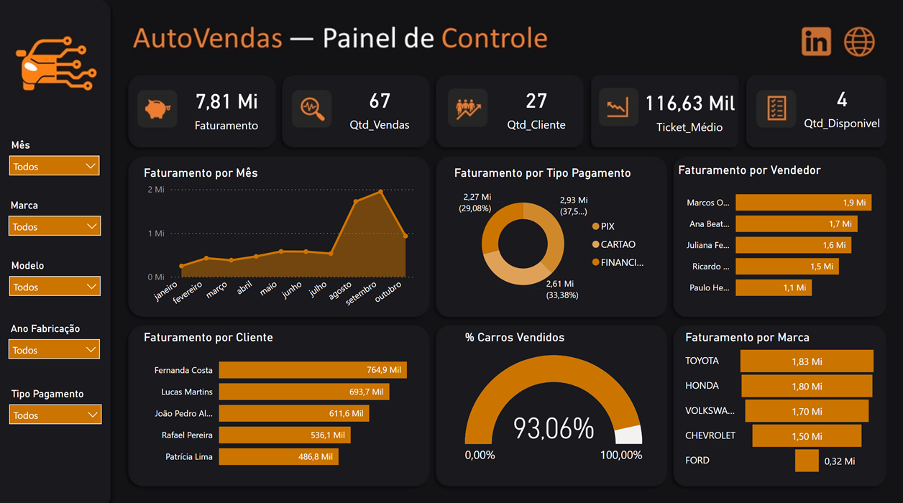

# Database Project — AutoVendas

Projeto de desenvolvimento de banco de dados relacional para gerenciamento de vendas de uma concessionária, integrado a um dashboard analítico no Power BI.

O projeto envolve modelagem de dados, relacionamentos, consultas SQL, procedures, triggers e análise dos principais indicadores comerciais.

---

## Problema de Negócio

Uma concessionária precisava de uma solução para organizar suas informações comerciais e ter maior controle sobre seu estoque de veículos, clientes, vendedores, formas de pagamento e vendas.

A ausência de uma estrutura centralizada dificultava o acompanhamento do desempenho comercial e a identificação de informações importantes, como:

- Quais marcas possuem maior quantidade de veículos?
- Quais vendedores geram maior faturamento?
- Quais clientes apresentam maior volume de compras?
- Qual é o ticket médio das vendas?
- Quais veículos ainda estão disponíveis?
- Quais veículos nunca foram vendidos?
- Quais formas de pagamento são mais utilizadas?
- Qual é a participação dos veículos vendidos no estoque?

Diante desse cenário, foi desenvolvida uma solução utilizando SQL Server para estruturar e gerenciar os dados da concessionária, juntamente com um dashboard analítico para transformar essas informações em indicadores visuais.

---

# Objetivo do Projeto

Desenvolver uma solução de dados capaz de centralizar as informações comerciais da concessionária e fornecer uma visão analítica do desempenho das vendas.

O projeto teve como principais objetivos:

- estruturar um banco de dados relacional;
- organizar informações de veículos, marcas e modelos;
- controlar clientes, vendedores e formas de pagamento;
- registrar as vendas realizadas;
- controlar a situação dos veículos;
- desenvolver consultas SQL para análise comercial;
- automatizar o processo de fechamento de vendas;
- preservar o histórico das operações realizadas;
- construir um dashboard para acompanhamento dos principais indicadores.

---

# Solução Desenvolvida

A solução foi construída em duas partes principais:

### 1. Banco de Dados

Foi desenvolvido um banco de dados relacional contendo entidades relacionadas a:

- marcas;
- modelos;
- veículos;
- clientes;
- vendedores;
- formas de pagamento;
- vendas.

Os relacionamentos entre as tabelas permitem conectar as informações de veículos às suas respectivas marcas e modelos, além de relacionar cada venda ao cliente, vendedor, forma de pagamento e veículo.

### 2. Dashboard Analítico

Os dados armazenados no banco foram utilizados para construção de um dashboard no Power BI, permitindo acompanhar de forma visual os principais indicadores comerciais da concessionária.

O dashboard permite analisar faturamento, quantidade de vendas, clientes, ticket médio, veículos disponíveis, desempenho por vendedor, faturamento por marca, clientes de maior valor e formas de pagamento.

---

# Estratégia de Análise

A análise foi desenvolvida utilizando consultas SQL para transformar os dados operacionais do banco em informações relevantes para o negócio.

## 1. Análise de Estoque

Foram desenvolvidas consultas para identificar:

- veículos disponíveis;
- veículos vendidos;
- veículos que nunca foram vendidos;
- quantidade de veículos por marca;
- modelos presentes no estoque.

Essa análise permite identificar a composição do estoque e possíveis veículos com menor movimentação.

## 2. Análise de Vendas

As consultas SQL foram utilizadas para analisar:

- faturamento total;
- valor vendido por vendedor;
- maior venda individual;
- quantidade de carros vendidos;
- ticket médio;
- evolução e distribuição das vendas.

Esses indicadores permitem avaliar o desempenho comercial da concessionária.

## 3. Análise de Clientes

Também foram realizadas consultas para identificar:

- clientes que já realizaram compras;
- clientes com maior volume financeiro;
- valor total gasto por cliente.

Essa análise permite identificar clientes de maior valor para o negócio.

## 4. Análise de Formas de Pagamento

Foi analisada a quantidade de veículos vendidos por forma de pagamento, permitindo compreender quais modalidades possuem maior participação nas vendas.

---

# Regras de Negócio

Além do armazenamento dos dados, o banco possui regras para garantir maior controle sobre as operações.

### Controle da situação dos veículos

Os veículos possuem os status:

- `DISPONIVEL`
- `VENDIDO`

A estrutura do banco possui uma restrição para impedir valores diferentes dos status definidos.

### Procedure de fechamento de vendas

Foi criada a procedure `FECHAMENTO_VENDAS` para automatizar o processo de venda.

Antes de registrar uma nova venda, a procedure verifica se o veículo já está marcado como `VENDIDO`. Caso esteja, a operação é interrompida e uma mensagem de erro é apresentada.

Quando a venda é realizada, o registro é inserido na tabela de vendas e a situação do veículo é automaticamente alterada para `VENDIDO`.

Essa abordagem reduz a possibilidade de inconsistências no processo de venda.

---

# Controle e Histórico das Vendas

Para preservar o histórico das operações, foi criado um banco separado denominado `BACKUPS`, contendo a tabela `BACKUP_VENDAS`.

Uma trigger é executada após operações de:

- `INSERT`;
- `DELETE`;
- `UPDATE`.

Cada operação é registrada juntamente com a data da operação e o tipo de alteração realizada.

Dessa forma, alterações realizadas na tabela de vendas podem ser rastreadas posteriormente, aumentando o controle e a segurança das informações.

---

# Consultas SQL

Entre as principais análises desenvolvidas estão:

- veículos disponíveis por marca e modelo;
- clientes que já realizaram compras;
- vendedores sem vendas registradas;
- quantidade de veículos por marca;
- faturamento por vendedor;
- vendas por forma de pagamento;
- clientes com maior valor total de compras;
- ticket médio da concessionária;
- veículos que nunca foram vendidos;
- maior venda individual realizada.

As consultas utilizam recursos como:

- `INNER JOIN`;
- `LEFT JOIN`;
- `GROUP BY`;
- `ORDER BY`;
- `SUM()`;
- `COUNT()`;
- `AVG()`;
- `TOP`.

---

# Dashboard Analítico

O dashboard foi desenvolvido no Power BI com o objetivo de transformar os dados do banco de dados em uma visão gerencial do desempenho comercial.

Entre os principais indicadores apresentados estão:

- **Faturamento:** R$ 7,81 Mi
- **Quantidade de vendas:** 67
- **Quantidade de clientes:** 27
- **Ticket médio:** R$ 116,63 Mil
- **Veículos disponíveis:** 4
- **Percentual de carros vendidos:** 93,06%

Também são apresentadas análises sobre:

- faturamento por mês;
- faturamento por tipo de pagamento;
- faturamento por vendedor;
- faturamento por cliente;
- faturamento por marca;
- percentual de carros vendidos.

Essas visualizações permitem identificar rapidamente os principais responsáveis pelo faturamento, o comportamento das vendas e a situação atual do estoque.

---

## Imagem do Dashboard

---

# Principais Insights

A análise do dashboard permite identificar alguns pontos relevantes:

### 1. Alto percentual de veículos vendidos

O dashboard apresenta aproximadamente **93,06% dos veículos como vendidos**, indicando uma alta taxa de movimentação do estoque.

### 2. Faturamento de R$ 7,81 milhões

A concessionária apresenta aproximadamente **R$ 7,81 milhões em faturamento**, sendo este um dos principais indicadores para acompanhamento do desempenho comercial.

### 3. 67 vendas realizadas

Foram registradas **67 vendas**, permitindo relacionar o volume de transações ao faturamento obtido.

### 4. Toyota apresenta forte participação no faturamento

A análise por marca permite identificar a participação de cada fabricante no resultado comercial, destacando as marcas que possuem maior impacto financeiro.

### 5. Diferença de desempenho entre vendedores

O faturamento por vendedor evidencia quais profissionais apresentam maior contribuição para o resultado comercial.

### 6. Estoque disponível reduzido

O dashboard apresenta **4 veículos disponíveis**, enquanto a maior parte dos veículos já foi vendida.

Esse indicador pode ser utilizado para apoiar decisões relacionadas à reposição do estoque.

---

# Como o Projeto Apoia a Tomada de Decisão

A solução permite que a concessionária utilize seus dados para:

- acompanhar o faturamento;
- avaliar o desempenho dos vendedores;
- identificar clientes de maior valor;
- acompanhar o ticket médio;
- analisar as formas de pagamento;
- identificar marcas com maior participação nas vendas;
- acompanhar veículos disponíveis;
- identificar veículos com baixa movimentação;
- monitorar a taxa de veículos vendidos;
- apoiar decisões relacionadas à reposição de estoque;
- utilizar dados históricos para avaliar o desempenho comercial.

---

# Acesso ao Projeto

O dashboard está disponível para visualização através do link abaixo:

🔗 **[Acessar Dashboard AutoVendas](https://app.powerbi.com/view?r=eyJrIjoiNmQ0ZGVkNDEtNGZlZC00ZjhhLTk3NGEtYTkyOTcyZWU4ZjE0IiwidCI6IjFkYjg3Njk3LWJhNWUtNDcyMC1iNmQ1LTIxNzA3Y2Q5YTRjNyJ9)**
